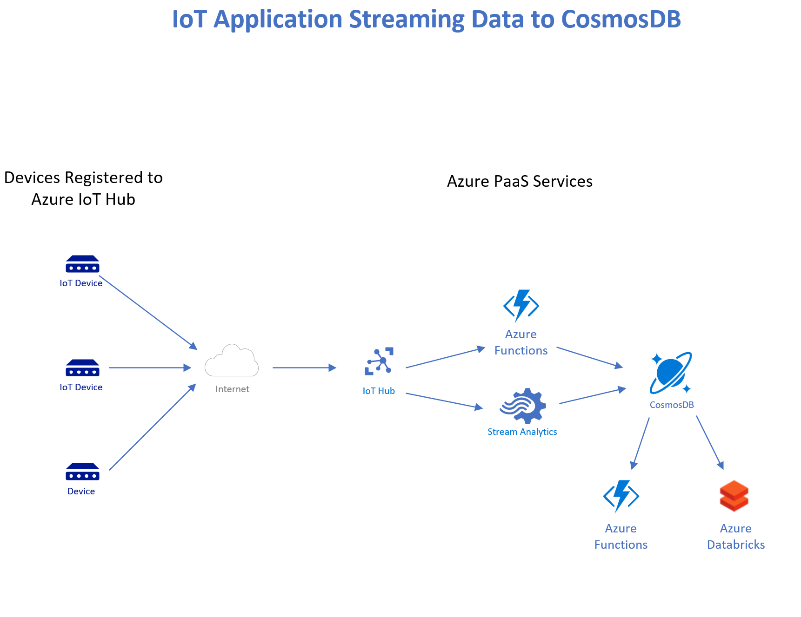

# Streaming Data Ingestion Pipelines into CosmosDB

## Azure PaaS Services

- Azure Event Hubs
- Azure Functions - serverless, event-driven
- Azure CosmosDB
- Azure Stream Analytics 

### Solution 1

- Azure Functions (HttpTrigger) -> CosmosDB

### Solution 2

- Event Hubs -> Azure Functions -> CosmosDB

- We'll focus on this one today; what we'll do:
  - See the EventHub and the Function App in Azure Portal
  - Create Functions using the **Azure CLI and Functions Tooling** (azure-functions-core-tools)
  - Write the Functions in **TypeScript**
  - Compile/Transpile them into **JavaScript (Node.js)**
  - **Test the Functions locally** on Developer Workstation (Windows, Mac, Linux)
  - **Deploy the Function App to Azure**, Discuss Deployment Options

  - Use a **DotNet Core Client Program** to:
    - Write some world Airports data to the EventHub
    - Query the destination collection in Azure Portal
    - **Query GeoSpatial data (GeoJSON)** in the collection in Azure Portal

  - Discuss another Function that reads the **CosmosDB change-feed**

  - Have CosmosDB automatically **replicate** the data to other regions

- [Azure Functions Code](solutions/functions-node/readme.md) in solutions/functions-node/ directory

### Solution 3

- Event Hubs -> Azure Stream Analytics -> CosmosDB
- [IoT with PaaS](https://github.com/cjoakim/azure-cosmosdb-iot)

### Solutions 4 to ...

- There are many possible solutions; HDInsight Kafka, Spark, etc

---

