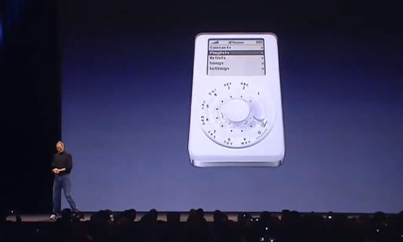
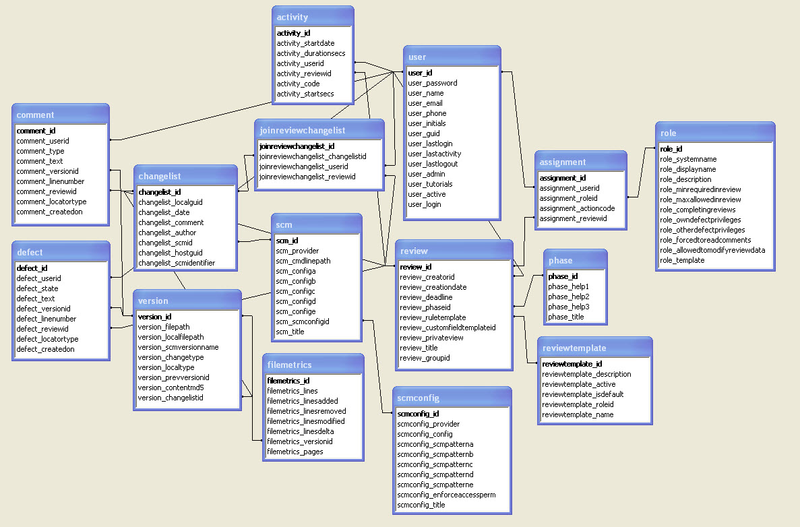

## Design with the Document/SQL Database

### Comparison; the evolution of the Telephone

---

---

---

---

## Don't

- Don't create collection designs like the above schema
  - there is no referential integrity
  - No need for [Third normal form (3NF) ](https://en.wikipedia.org/wiki/Third_normal_form)
  - storage is inexpensive now
- Don't put differently-shaped documents in different collections
- Don't think relationally; this is a NoSQL Document-Oriented database

## Best Practices

- Think first about how you will query your data
  - Identify your use-cases for your application
  - Identify your queries in your application

- Use a generic name for the **partition key** in each collection
  - **pk**, partition_key, partitionKey - these are recommended names
  - pk values should have a high cardinality - thousands or values or more
  - The values that you use to populate the pk can and will evolve over time
  - Most of you queries should use the partition key

- Put differently-shaped documents in the same collection
  - It's schemaless!  This is allowed, and a good practice
  - Use a **doctype** attribute to identify the type of the Document

- Think of collections as **unit-for-scaling** rather than a type of data
  - The Request Units (RU) can be configured separately for each collection

- Do **"partition key joins"** rather than **"cross-collection joins"**
  - Meaning, read the related documents with one pk value in one query

- Be aware of the **Request Charge** for each of your queries
  - The SDKs will make this response value available

