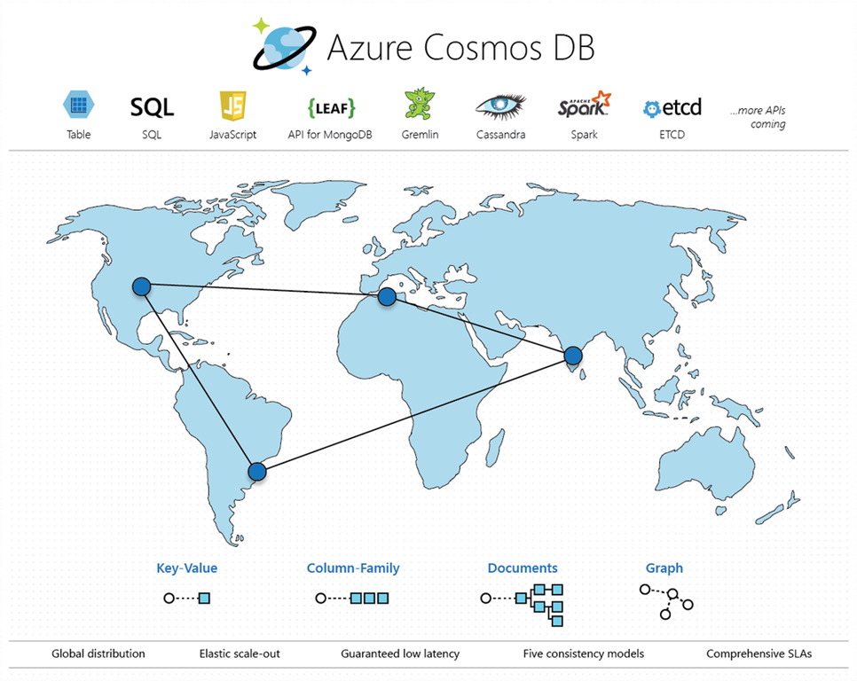

# CosmosDB Overview, Roadmap, Demonstrations

## Agenda

- Overview of CosmosDB  (10 min)
  - https://github.com/cjoakim/azure-cosmosdb-hackathon/blob/master/oct.md

- SQL API demo with Spatial Data  (10 min)
  - Azure Portal UI
  - Partition Key and Partitions
    - /pk attribute
    - Metrics -> Storage -> Dev -> Airports
  - New Jupyter Notebooks with GEO queries

- Product Roadmap  (10 min)

- Graph API demo for Bill-of-Material  (15 min)
  - https://github.com/Azure-Samples/azure-cosmos-db-graph-npm-bom-sample
  - Vertices, Edges
  - Apache TinkerPop project, Gremlin Graph Traversal Language
  - https://github.com/Azure-Samples/azure-cosmos-db-graph-npm-bom-sample/blob/master/data/gremlin/gremlin_load_file.txt

- IoT Example Architecture  (5 min, optional)
  - https://github.com/cjoakim/azure-cosmosdb-iot

- Discussion  (10-15 min)

---

