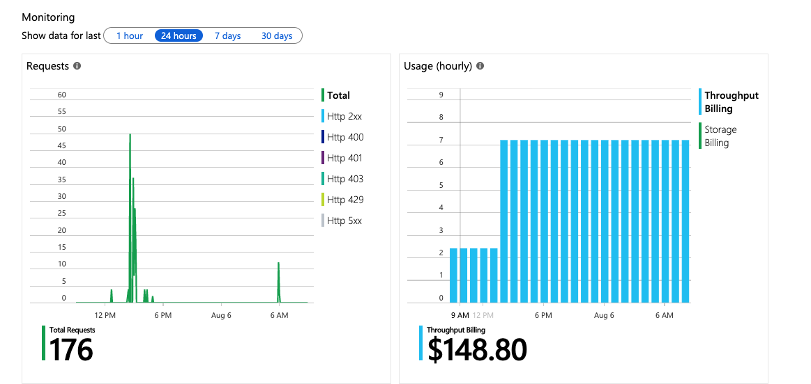

## Performance Tips

### Scale Daily per Your Usage Patterns



### Utilize Time-to-Live

TTL functionality eliminates the need to explicitly spend RUs to delete obsolete documents.

### Optimize Indexes If Necessary

- Include and Exclude Paths

- Three kinds of Indexes
  - Range - equality, range, ORDER BY, joins
  - Spatial - for Geospatial/GeoJSON data
  - Composite - for ORDER BY queries on multiple properties

- indexingMode
  - Consistent - synchronous
  - None - used as a pure key-value store

[Indexing Policy Docs](https://docs.microsoft.com/en-us/azure/cosmos-db/index-policy)

#### Default indexing policy

```
{
    "indexingMode": "consistent",
    "automatic": true,
    "includedPaths": [
        {
            "path": "/*",
            "indexes": []
        }
    ],
    "excludedPaths": [
        {
            "path": "/\"_etag\"/?"
        }
    ],
    "spatialIndexes": [
        {
            "path": "/*",
            "types": [
                "Point"
            ]
        }
    ]
}
```

### Programming - Stored Procedures, Triggers, UDFs

Utilize Stored Procedures for "one trip API calls" to the Database.

- [Server Side](server_side.md)

