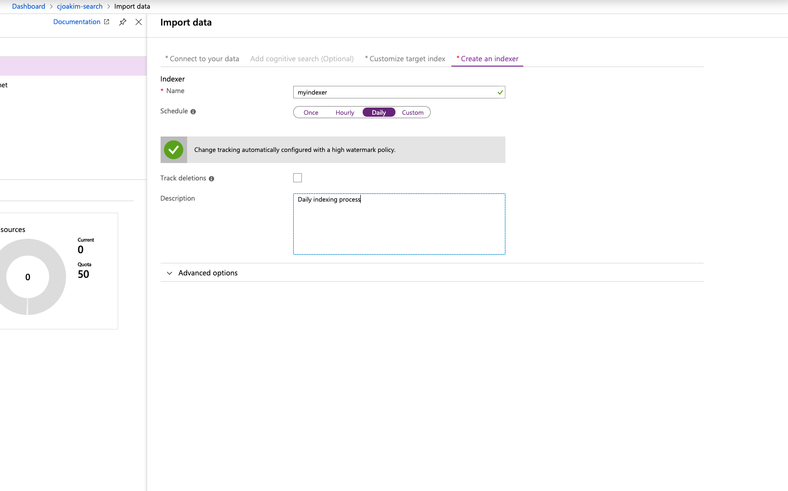
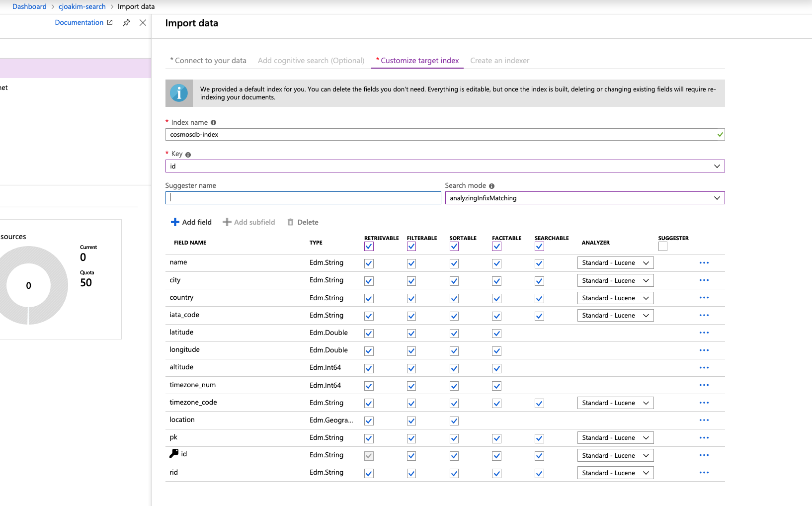

# azure-cosmosdb-hackathon - Azure Search Integration

## Links

- https://azure.microsoft.com/en-us/services/search/
- https://docs.microsoft.com/en-us/azure/search/search-howto-index-cosmosdb

## Example

[World Airports Dataset, 8102 airports](solutions/python/data/world_airports_flat.json)

---

### Load the CosmosDB Collection

```
$ cd solutions\python
$ ./venv.sh               # create the python virtual environment
$ source bin/activate     # activate the python virtual environment

$ python challenge3.py load_azure_sql_collection dev world_airports data/world_airports_flat.json --to-numerics
```

The Documents in the CosmosDB world_airports collection look like this:

```
{
    "name": "Madang",
    "city": "Madang",
    "country": "Papua New Guinea",
    "iata_code": "MAG",
    "latitude": -5.207083,
    "longitude": 145.7887,
    "altitude": 20,
    "timezone_num": 10,
    "timezone_code": "Pacific/Port_Moresby",
    "location": {
        "type": "Point",
        "coordinates": [
            145.7887,
            -5.207083
        ]
    },
    "pk": "MAG",
    "id": "5da87995-6816-42a7-aebc-a4da627c172d",
    "_rid": "M2ZjAI9Jp9YBAAAAAAAAAA==",
    "_self": "dbs/M2ZjAA==/colls/M2ZjAI9Jp9Y=/docs/M2ZjAI9Jp9YBAAAAAAAAAA==/",
    "_etag": "\"3a00ee31-0000-0100-0000-5d2776c90000\"",
    "_attachments": "attachments/",
    "_ts": 1562867401
}

{
    "name": "St Anthony",
    "city": "St. Anthony",
    "country": "Canada",
    "iata_code": "YAY",
    "latitude": 51.391944,
    "longitude": -56.083056,
    "altitude": 108,
    "timezone_num": -3.5,
    "timezone_code": "America/St_Johns",
    "location": {
        "type": "Point",
        "coordinates": [
            -56.083056,
            51.391944
        ]
    },
    "pk": "YAY",
    "id": "e4988bc0-a567-4b0f-a245-2d75f4821052",
    "_rid": "M2ZjAI9Jp9YMAAAAAAAAAA==",
    "_self": "dbs/M2ZjAA==/colls/M2ZjAI9Jp9Y=/docs/M2ZjAI9Jp9YMAAAAAAAAAA==/",
    "_etag": "\"3a001732-0000-0100-0000-5d2776cf0000\"",
    "_attachments": "attachments/",
    "_ts": 1562867407
}
```

---

### Create the Azure Search Index

#### Import - Create Indexer



#### Import - Target Index



Filter Query:
```
SELECT * FROM c WHERE c.altitude < 30000 and c._ts >= @HighWaterMark ORDER BY c._ts
```

---

### Use the Azure Search Index

#### With Search Explorer

[Search Explorer in Azure Portal](https://docs.microsoft.com/en-us/azure/search/search-explorer)

```
search=*

search=Atlanta
https://cjoakim-search.search.windows.net/indexes/cosmosdb-index/docs?api-version=2019-05-06&search=Atlanta

search=Atlanta&$count=true

search=Atlanta&$count=true&$select=iata_code,name,city,latitude,longitude,altitude

search=*&$filter= altitude gt 5000&$count=true

search=*&$count=true&$filter=geo.distance(location, geography'POINT(-84.396158 33.766339)') le 10

```

---

#### With the command-line and curl

See bash script **azure_search.sh**

```
curl -X GET \
    -H 'Content-Type: application/json' \
    -H 'Accept: application/json' \
    -H 'api-key: '$AZURE_SEARCH_QUERY_KEY \
    'https://cjoakim-search.search.windows.net/indexes/cosmosdb-index/docs?api-version=2019-05-06&search=Atlanta&$select=iata_code,name,city,latitude,longitude,altitude'
```

Invoke the script:

```
./azure_search.sh 
or
./azure_search.sh | jq
```
