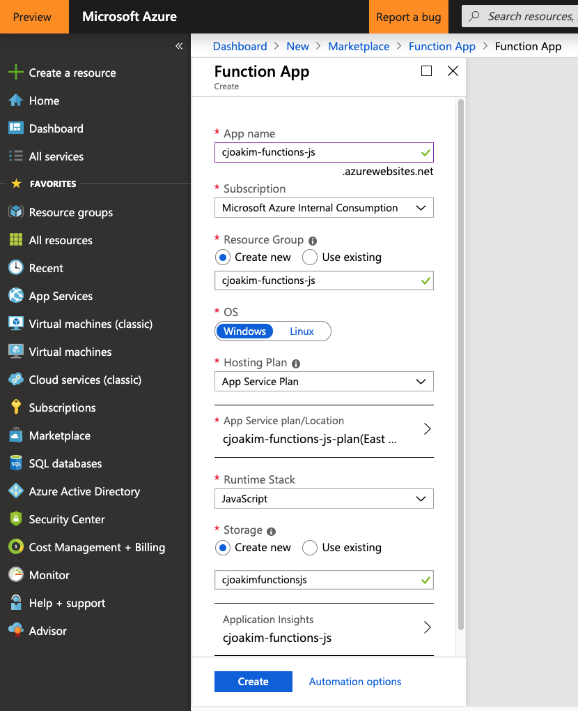

# azure-cosmosdb-hackathon - Azure Functions

Sample Azure Function App, created with CLI tools, and written in TypeScript for Node.js runtime


## Azure Functions

**Azure Functions = Serverless, Event-Driven Compute Service**

Author code in **C#, F#, JavaScript, TypeScript, Java, PowerShell, or Python**

Multiple Deployment Options: CI/CD from repository, Azure DevOps, Zip/CLI, etc

## Links

- https://docs.microsoft.com/en-us/azure/azure-functions/
- https://docs.microsoft.com/en-us/azure/azure-functions/functions-run-local
- https://docs.microsoft.com/en-us/azure/azure-functions/scripts/functions-cli-create-serverless
- https://docs.microsoft.com/en-us/azure/azure-functions/functions-reference-node
- https://www.typescriptlang.org/index.html
- https://code.visualstudio.com/docs/typescript/typescript-tutorial

## Setup

### Create an Azure Function App

In Azure Portal, you can provision a new Function App like this:



Alternatively, you can create a Function app via the CLI like this:

```
#!/bin/bash

# Function app and storage account names must be unique.
storageName=mystorageaccount$RANDOM
functionAppName=myserverlessfunc$RANDOM

# Create a resource group.
az group create --name myResourceGroup --location westeurope

# Create an Azure storage account in the resource group.
az storage account create \
  --name $storageName \
  --location westeurope \
  --resource-group myResourceGroup \
  --sku Standard_LRS

# Create a serverless function app in the resource group.
az functionapp create \
  --name $functionAppName \
  --storage-account $storageName \
  --consumption-plan-location westeurope \
  --resource-group myResourceGroup
```

### Windows Development Workstation:

```
npm install -g azure-functions-core-tools
```

### macOS Development Workstation:

```
$ brew tap azure/functions
$ brew install azure-functions-core-tools
```

### Create Project with the CLI tools

Create a project named hackathon
```
$ func init hackathon
Select a worker runtime:
1. dotnet
2. node
3. python (preview)
4. powershell (preview)
Choose option: 2
node
Select a Language:
1. javascript
2. typescript
Choose option: 2
typescript
Writing .funcignore
Writing package.json
Writing tsconfig.json
Writing .gitignore
Writing host.json
Writing local.settings.json
Writing /Users/cjoakim/github/azure-cosmosdb-hackathon/solutions/functions-node/hackathon/.vscode/extensions.json
```

Then add the extensionBundle to **host.json**, like this:
```
{
    "version": "2.0",
    "extensionBundle": {
        "id": "Microsoft.Azure.Functions.ExtensionBundle",
        "version": "[1.*, 2.0.0)"
    }
}
```

Note that a **.gitignore** file was created.  It includes several entries, including:
```
...
appsettings.json
local.settings.json
...
```

Notice also that a **tsconfig.json** file was created, since **TypeScript** 
was specified as the programming language.

Get your function app settings from Azure, this updates your git-ignored **local.settings.json** file.
```
$ cd hackathon

$ npm install
$ npm install --save-dev grunt grunt-cli load-grunt-tasks   <-- additional libraries I use

$ func azure functionapp fetch-app-settings cjoakim-functions-js
App Settings:
Loading FUNCTIONS_WORKER_RUNTIME = *****
Loading AzureWebJobsStorage = *****
Loading FUNCTIONS_EXTENSION_VERSION = *****
Loading WEBSITE_NODE_DEFAULT_VERSION = *****
Loading APPINSIGHTS_INSTRUMENTATIONKEY = *****

Connection Strings:

$ cat local.settings.json
{
  "IsEncrypted": false,
  "Values": {
    "FUNCTIONS_WORKER_RUNTIME": "node",
    "AzureWebJobsStorage": "DefaultEndpointsProtocol=https;AccountName=cjoakimfunctionsjs;AccountKey=...secret...",
    "FUNCTIONS_EXTENSION_VERSION": "~2",
    "WEBSITE_NODE_DEFAULT_VERSION": "10.14.1",
    "APPINSIGHTS_INSTRUMENTATIONKEY": "f59f1dbf-e9e9-465c-9a56-38d2df375117"
  },
  "ConnectionStrings": {}
}
```

Also get the storage connection string:
```
$ func azure storage fetch-connection-string cjoakimfunctionsjs
Secret saved locally in local.settings.json under name cjoakimfunctionsjs_STORAGE.
```

### Create, Develop, and Test a HTTP Trigger Function on your Workstation

Create a HTTP request triggered Function:
```
$ func new
Select a template:
1. Azure Blob Storage trigger
2. Azure Cosmos DB trigger
3. Durable Functions activity
4. Durable Functions HTTP starter
5. Durable Functions orchestrator
6. Azure Event Grid trigger
7. Azure Event Hub trigger
8. HTTP trigger                        <--
9. IoT Hub (Event Hub)
10. Azure Queue Storage trigger
11. SendGrid
12. Azure Service Bus Queue trigger
13. Azure Service Bus Topic trigger
14. Timer trigger
Choose option: 8
HTTP trigger
Function name: [HttpTrigger]
Writing /Users/cjoakim/github/azure-cosmosdb-hackathon/solutions/functions-node/hackathon/HttpTrigger/index.ts
Writing /Users/cjoakim/github/azure-cosmosdb-hackathon/solutions/functions-node/hackathon/HttpTrigger/function.json
The function "HttpTrigger" was created successfully from the "HTTP trigger" template.
```

Create an EventHub message triggered Function:
```
$ func new
Select a template:
1. Azure Blob Storage trigger
2. Azure Cosmos DB trigger
3. Durable Functions activity
4. Durable Functions HTTP starter
5. Durable Functions orchestrator
6. Azure Event Grid trigger
7. Azure Event Hub trigger             <--
8. HTTP trigger
9. IoT Hub (Event Hub)
10. Azure Queue Storage trigger
11. SendGrid
12. Azure Service Bus Queue trigger
13. Azure Service Bus Topic trigger
14. Timer trigger
Choose option: 7
Azure Event Hub trigger
Function name: [EventHubTrigger]
Writing /Users/cjoakim/github/azure-cosmosdb-hackathon/solutions/functions-node/hackathon/EventHubTrigger/index.ts
Writing /Users/cjoakim/github/azure-cosmosdb-hackathon/solutions/functions-node/hackathon/EventHubTrigger/function.json
The function "EventHubTrigger" was created successfully from the "Azure Event Hub trigger" template.
```

#### Compile/Transpile the TypeScript into JavaScript

```
$ npm run-script build
```

Alternatively, execute my **build.sh** script, which lists the output files:
```
$ ./build.sh
Running "build-timestamp" task
build-timestamp: Sat Jul 06 2019 06:45:04 GMT-0400 (EDT)

Done.
total 0
drwxr-xr-x   4 cjoakim  staff  128 Jul  6 06:43 .
drwxr-xr-x  21 cjoakim  staff  672 Jul  6 06:45 ..
drwxr-xr-x   4 cjoakim  staff  128 Jul  6 06:45 EventHubTrigger
drwxr-xr-x   4 cjoakim  staff  128 Jul  6 06:45 HttpTrigger

dist/EventHubTrigger:
total 16
drwxr-xr-x  4 cjoakim  staff   128 Jul  6 06:45 .
drwxr-xr-x  4 cjoakim  staff   128 Jul  6 06:43 ..
-rw-r--r--  1 cjoakim  staff  1097 Jul  6 06:45 index.js
-rw-r--r--  1 cjoakim  staff   400 Jul  6 06:45 index.js.map

dist/HttpTrigger:
total 16
drwxr-xr-x  4 cjoakim  staff   128 Jul  6 06:45 .
drwxr-xr-x  4 cjoakim  staff   128 Jul  6 06:43 ..
-rw-r--r--  1 cjoakim  staff  1371 Jul  6 06:45 index.js
-rw-r--r--  1 cjoakim  staff   629 Jul  6 06:45 index.js.map
done
```

#### Configure the Azure Function in Azure Portal

Add your **EventHub and CosmosDB connection configuration** in Function Platform Settings -> Configuration:
```
cjoakimeventhubs_RootManageSharedAccessKey_EVENTHUB = Endpoint=sb://cjoakimeventhubs.servicebus.windows.net/; ...secret...
cjoakimcosmosdbsql_DOCUMENTDB = AccountEndpoint=https://cjoakimcosmosdbsql.documents.azure.com:443/;AccountKey=...secret...
```

Fetch your app settings again to get the new CosmosDB EVENTHUB and DOCUMENTDB settings:
```
$ func azure functionapp fetch-app-settings cjoakim-functions-js

App Settings:
Loading APPINSIGHTS_INSTRUMENTATIONKEY = *****
Loading AzureWebJobsStorage = *****
Loading cjoakimcosmosdbsql_DOCUMENTDB = *****                            <--
Loading cjoakimeventhubs_RootManageSharedAccessKey_EVENTHUB = *****      <--
Loading FUNCTIONS_EXTENSION_VERSION = *****
Loading FUNCTIONS_WORKER_RUNTIME = *****
Loading WEBSITE_NODE_DEFAULT_VERSION = *****

Connection Strings::
```

#### Configure the Azure Function - function.json files

The HttpTrigger function; add the output bindings:
```
{
  "bindings": [
    {
      "authLevel": "function",
      "type": "httpTrigger",
      "direction": "in",
      "name": "req",
      "methods": [
        "get",
        "post"
      ]
    },
    {
      "type": "http",
      "direction": "out",
      "name": "res"
    },
    {
      "type": "cosmosDB",
      "name": "outDoc",
      "databaseName": "dev",
      "collectionName": "function",
      "createIfNotExists": false,
      "connectionStringSetting": "cjoakimcosmosdbsql_DOCUMENTDB",
      "partitionKey": "/pk",
      "direction": "out"
    }
  ],
  "scriptFile": "../dist/HttpTrigger/index.js"
}
```

The EventHubTrigger function; add the input and output bindings:
```
{
  "bindings": [
    {
      "type": "eventHubTrigger",
      "name": "eventHubMessages",
      "direction": "in",
      "eventHubName": "dev",
      "connection": "cjoakimeventhubs_RootManageSharedAccessKey_EVENTHUB",
      "cardinality": "many",
      "consumerGroup": "$Default"
    },
    {
      "type": "cosmosDB",
      "name": "outDoc",
      "databaseName": "dev",
      "collectionName": "functions",
      "createIfNotExists": false,
      "connectionStringSetting": "cjoakimcosmosdbsql_DOCUMENTDB",
      "partitionKey": "/pk",
      "direction": "out"
    }
  ],
  "scriptFile": "../dist/EventHubTrigger/index.js"
}
```

#### Test the Function App Locally on your Workstation

```
$ func host start

                  %%%%%%
                 %%%%%%
            @   %%%%%%    @
          @@   %%%%%%      @@
       @@@    %%%%%%%%%%%    @@@
     @@      %%%%%%%%%%        @@
       @@         %%%%       @@
         @@      %%%       @@
           @@    %%      @@
                %%
                %

Azure Functions Core Tools (2.7.1373 Commit hash: cd9bfca26f9c7fe06ce245f5bf69bc6486a685dd)
Function Runtime Version: 2.0.12507.0
[6/14/19 2:53:25 PM] Starting Rpc Initialization Service.
[6/14/19 2:53:25 PM] Initializing RpcServer
[6/14/19 2:53:25 PM] Building host: startup suppressed:False, configuration suppressed: False
[6/14/19 2:53:25 PM] Initializing Host.
...
Content root path: /Users/cjoakim/github/azure-functions-cli-typescript/project
Now listening on: http://0.0.0.0:7071
Application started. Press Ctrl+C to shut down.

Http Functions:

	HttpTrigger: [GET,POST] http://localhost:7071/api/HttpTrigger
```

Invoke the HTTP Function with curl:
```
$ curl http://localhost:7071/api/HttpTrigger?name=MollyMcKay
Hello MollyMcKay
```

### Deploy to Azure

```
$ ./deploy.sh
Getting site publishing info...
Creating archive for current directory...
Uploading 13.28 MB [##############################################################################]
Upload completed successfully.
Deployment completed successfully.
Syncing triggers...
Functions in cjoakim-functions-js:
    HttpTrigger - [httpTrigger]
        Invoke url: https://cjoakim-functions-js.azurewebsites.net/api/httptrigger?code=Dr15O1QXcBfHv4KgKQePdB4WUNdmb/hS6qU1PtINymVhiopDiSXnSw==

    EventHubTrigger - [eventHubTrigger]

done
```

Save the above secret HttpTrigger URL as environment variable **AZURE_FUNCTION_URL** on your workstation.

Then, invoke the deployed Function with curl:
```
$ curl $AZURE_FUNCTION_URL"&name=Miles"
{
  "pk": "Miles-1562414935433",
  "name": "Miles",
  "date": "Sat Jul 06 2019",
  "epoch": 1562414935433,
  "build_timestamp": "Sat Jul 06 2019 07:51:25 GMT-0400 (EDT)",
  "function_name": "HttpTrigger",
  "function_invocation_id": "e1e396fe-68ac-4506-ab19-d8959e71bafb",
  "function_directory": "D:\\home\\site\\wwwroot\\HttpTrigger"
}
```

Alternatively, see deploy.sh

### TypeScript and Visual Studio Code

Visual Studio Code is an excellent lightweight, free, and cross-platform editor.
It, itself, is built with Node.js, TypeScript, and JavaScript.

It offers many features, including **IntelliSense**, as shown below:


