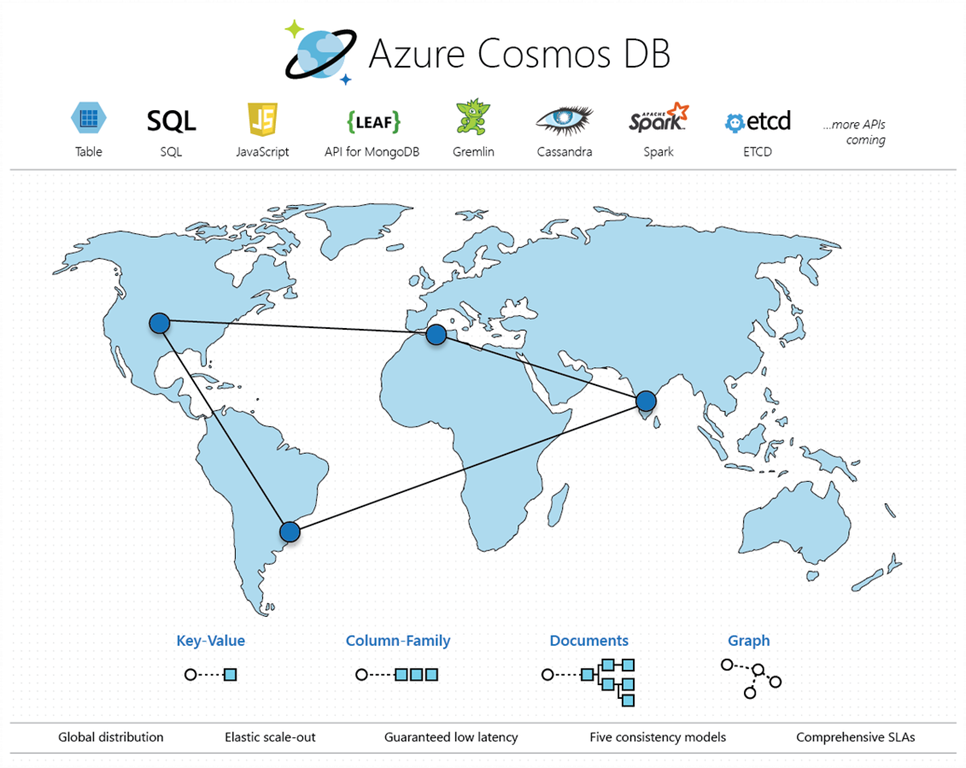

# What is CosmosDB?

- It's a **Family of NoSQL PaaS databases** built on a common foundation 

- **Six Database Types Currently Supported**
  - Microsoft:
    - SQL API
    - Table API
  - Open-Source:
    - MongoDB
    - Cassandra
    - Gremlin / TinkerPop
    - etcd 

- **You provision a specific type of database for each CosmosDB instance**
  - One CosmosDB instance does not offer all six DB types!
  - This is a similar model to Azure HDInsight (Spark, Hadoop, HBase, Storm, Kafka, etc.)

- **Programming APIs**
  - Microsoft: SQL and Table
    - Microsoft publishes open-source libraries in DotNet, Java, Node.js, Python, Go, etc.
    - HTTP/REST also supported
  - Open-Source: MongoDB, Cassandra, Gremlin, etcd 
    - Bring your own language and SDK library (i.e. - MongoDB, Python, and pymongo)
    - Distributed reliable key-value store, used by Kubernetes and AKS

- **Global Distribution**
  - Deployable to [all 54 Azure Regions](https://docs.microsoft.com/en-us/azure/cosmos-db/regional-presence)
  - Single-Region
  - Multi-Region with one write-region
  - Multi-Region with multiple write-regions

- **Elastic Scale**
  - Request Units, or **RUs**
    - Simply Scale the Database by number of RUs 
    - [RU is a Unit of CPU, IOPS, and Memory](https://docs.microsoft.com/en-us/azure/cosmos-db/request-units)
    - The cost to read a 1-KB item is 1.0 RU
    - Our SDKs return the cost of the DB operation in terms of RUs
    - [RU Calculator page](https://www.documentdb.com/capacityplanner)
  - Scale is achieved via **Partitions**
  - Can achieve millions of reads and writes per second

- **Consistency Levels**
  - [Five Consistency Levels](https://docs.microsoft.com/en-us/azure/cosmos-db/consistency-levels)
    - Strong 
    - Bounded Staleness
    - Session
    - Consistent Prefix
    - Eventual
    - See https://docs.microsoft.com/en-us/azure/cosmos-db/how-to-manage-consistency#configure-the-default-consistency-level
  - Database-level default consistency level
  - But can be overridden on any individual DB operation

- **SLAs**
  - 99.99% single-region, 99.999% multi-region
  - See https://azure.microsoft.com/en-us/support/legal/sla/cosmos-db/v1_0/

- **Low Latency**
  - 10ms reads, 15ms writes in 99th percentile
  - 

- **Coming Soon**
  - Apache Spark
  - Notebooks

## Links

- https://docs.microsoft.com/en-us/azure/cosmos-db/introduction
- https://docs.microsoft.com/en-us/azure/cosmos-db/
- https://gotcosmos.com
- http://tinkerpop.apache.org
- http://cassandra.apache.org
- https://www.mongodb.com
